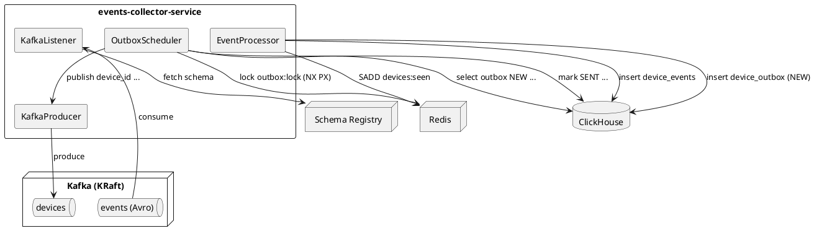
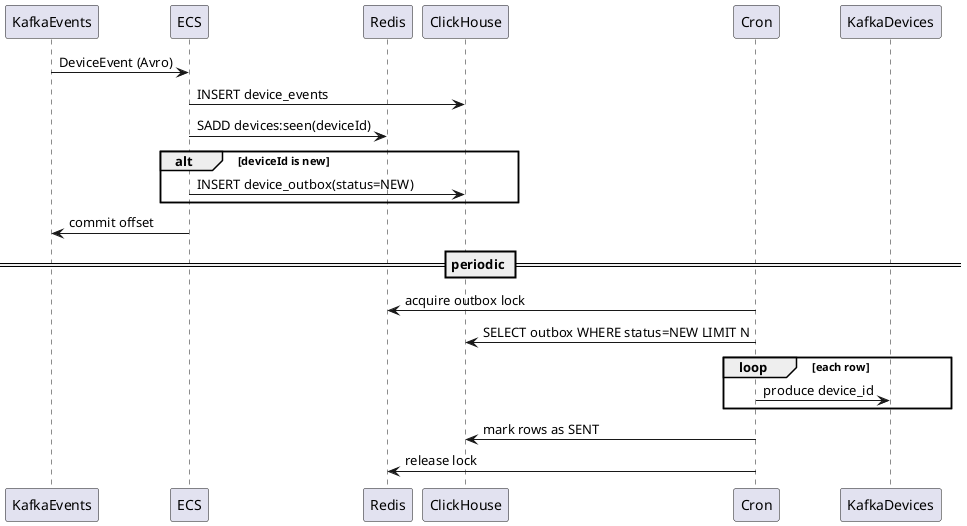

# Модуль 2 — Events Collector

## 🎯 **Цель**
Реализовать микросервис **events-collector-service**, который:
- Подписывается на Kafka-топик `events` и получает события в формате Avro (через Schema Registry)
- Обрабатывает сообщения **строго по одному** (без batch listener / без пачек)
- Сохраняет каждое событие в ClickHouse (таблица `device_events`) для аналитики
- Дедуплицирует новые `device_id` через Redis (вместо in-memory)
- Для публикации уникальных `device_id` использует паттерн **Transactional Outbox**

---

## 🛠 **Технологии** (фиксированы)
- **Java 24**
- **Spring Boot 3.5**
- **Apache Kafka** (кластер в docker-compose)
- **Confluent Schema Registry**
- **Avro** (сериализация входного события)
- **ClickHouse** (хранилище событий + outbox)
- **Redis** (дедупликация + distributed lock)
- **Gradle**
- **Testcontainers** (Kafka + Schema Registry + ClickHouse + Redis)
- **Spring Boot Actuator** (health/metrics)

---

## 📝 **Входной контракт события (Avro)**

### Топик: `events`

### Схема Avro (DeviceEvent):
```json
{
  "type": "record",
  "name": "DeviceEvent",
  "namespace": "com.nashkod.avro",
  "fields": [
    {"name": "eventId", "type": "string"},
    {"name": "deviceId", "type": "string"},
    {"name": "timestamp", "type": "long"},
    {"name": "type", "type": "string"},
    {"name": "payload", "type": "string"}
  ]
}
```
# Требование: сервис должен корректно десериализовать Avro через Schema Registry (Specific или Generic - на ваш выбор, но должно работать стабильно в docker-compose и в Testcontainers).

## 💾 Хранение в ClickHouse

### 4.1 Таблица device_events (все события)

Таблица предназначена для аналитики "по устройству / по времени".

Рекомендуем хранить event_date отдельно (вычисляете в сервисе из timestamp, чтобы не зависеть от специфических функций ClickHouse).

**DDL (рекомендуемый минимум):**

```sql
CREATE TABLE IF NOT EXISTS device_events
(
    device_id     String,
    event_id      String,
    event_date    Date,
    timestamp_ms  Int64,
    type          String,
    payload       String
)
ENGINE = MergeTree
PARTITION BY event_date
ORDER BY (device_id, event_date, timestamp_ms, event_id);
```

Правило вставки: каждый Kafka-message → одна вставка в ClickHouse.

### 4.2 Таблица device_outbox (Transactional Outbox)
Outbox хранит уникальные device_id, которые нужно опубликовать в Kafka.

**DDL (учебный, но рабочий):**
```sql
CREATE TABLE IF NOT EXISTS device_outbox
(
    device_id     String,
    created_at    DateTime,
    status        UInt8,          -- 0 = NEW, 1 = SENT
    sent_at       DateTime,
    attempts      UInt32,
    last_error    String
)
ENGINE = MergeTree
PARTITION BY toYYYYMM(created_at)
ORDER BY (status, created_at, device_id);
```

При создании записи: status=0, attempts=0, sent_at можно поставить toDateTime(0) или текущий (на ваше усмотрение).

CRON-джоба выбирает WHERE status=0 ORDER BY created_at LIMIT N.

## 🔴 Redis: дедупликация + распределённая синхронизация
### 5.1 Дедупликация device_id (глобально, для нескольких инстансов)
Используем Redis Set (точная дедупликация).

* ключ: devices:seen
* операция: SADD devices:seen <device_id>

Если SADD вернул 1 → device_id новый → нужно создать запись в outbox.
Если SADD вернул 0 → device_id уже встречался → outbox не создаем

Это ключевой момент: дедупликация должна работать при нескольких экземплярах сервиса.

### 5.2 Distributed lock для CRON Outbox (горизонтальное масштабирование)
Проблема: если запустить 3 инстанса сервиса, то CRON запустится на всех трех.
Нужно, чтобы outbox публиковал только один.

Решение: использовать Redis-lock на ключе, например: outbox:lock.

Минимальный механизм:
```bash
SET outbox:lock <instanceId> NX PX <ttlMs>
```
* если удалось (OK) - этот инстанс выполняет publish
* если нет - пропускаем итерацию

TTL обязателен (чтобы lock не завис навсегда при падении)

## 🔄 Логика обработки входного сообщения (строго по одному)
### 6.1 Требование "по одному"
* НЕ использовать batch listener
* max.poll.records = 1
* enable.auto.commit = false
* ack/commit только после успешной обработки

В терминах поведения: один record → полный цикл обработки → commit offset → следующий record.

### 6.2 Алгоритм (внутри @KafkaListener)
На каждое событие:

1. Десериализовать DeviceEvent (Avro + Schema Registry)
2. Сохранить событие в ClickHouse device_events 
3. Проверить device_id через Redis Set: SADD devices:seen deviceId 
4. Если новый (SADD==1) → вставить запись в ClickHouse device_outbox (status=0)
5. Подтвердить offset (commit/ack)

Обратите внимание: "первично" сохраняем событие. Dedup устройства - отдельный эффект.

## 📤 Публикация device_id в Kafka через Transactional Outbox (CRON)
CRON-джоба (внутри того же сервиса или отдельным компонентом внутри приложения):

1. Попытаться захватить outbox:lock в Redis 
2. Если lock получен:

* выбрать из ClickHouse device_outbox записи status=0 (например, LIMIT 100)

* для каждой записи:
  * отправить device_id в Kafka-топик devices
  * увеличить attempts / обработать ошибку
* после успешной отправки пометить запись как SENT (status=1, sent_at=now())

3. Освободить lock (или ждать TTL, но лучше освобождать явно, если вы владелец lock)

Важно про надежность:
* Если Kafka временно недоступна → outbox не теряется → повторим позже 
* Если запись отправилась, но статус не обновился → возможен дубль при следующем запуске

Чтобы закрыть эту дыру, добавьте вторичную идемпотентность:

* перед отправкой в Kafka делайте SADD devices:published <device_id> и отправляйте только если вернул 1
* это сильно упрощает жизнь в ClickHouse, где мутации не мгновенные.
* это "двойная защита": outbox + redis. В проде outbox чаще держат в транзакционной БД, но тут учебный компромисс.

## 🐳 Docker Compose (обязательное требование)
Решение должно быть полностью автономным локально.

В docker-compose.yml должны быть:
* Kafka (желательно KRaft)
* Schema Registry 
* ClickHouse 
* Redis 
* events-collector-service

Требования к Kafka-топикам:
* events - 3 партиции 
* devices - 3 партиции

Топики должны создаваться автоматически (init контейнер / скрипт / AdminClient), чтобы при запуске docker-compose up и все работало без ручных изменений.

## 📊 Spring Boot Actuator (обязательное требование)
В сервисе включить Actuator и открыть минимум:

* /actuator/health
* /actuator/metrics
* (опционально) /actuator/prometheus

Плюс приветствуются кастомные метрики:
* events.processed.total 
* events.duplicates.total 
* outbox.pending.count 
* outbox.publish.success.total 
* outbox.publish.fail.total

## 🧪 Тестирование (обязательное требование)
### 10.1 Покрытие
* Не менее 40% (unit + integration)

### 10.2 Минимальный набор тестов
Unit:
1. Дедупликация device_id через Redis-абстракцию (мок):

* new device → создается outbox-запись 
* existing device → outbox-запись не создается

2. Логика CRON-публикатора:

* выбрал N записей → отправил N сообщений → пометил SENT 
* ошибка отправки → attempts++, запись остается NEW (или last_error заполняется)

Integration (Testcontainers):
  1. Поднять Kafka + Schema Registry + ClickHouse + Redis 
  2. Отправить DeviceEvent в events 
  3. Проверить:
       * запись появилась в device_events (ClickHouse SELECT)
       * если device_id новый → запись появилась в device_outbox

  4. Триггернуть outbox publish(можно вызвать метод вручную в тесте, не ждать реального cron):

      * проверить, что device_id ушел в devices (тестовый consumer читает)
      * проверить, что outbox помечен SENT

Интеграционный тест должен быть полностью автономным: не зависит от локально запущенного docker-compose.

## 📁 Требования к структуре проекта и конфигам
* Все подключения (Kafka, Schema Registry, ClickHouse, Redis) - через application.yml + env vars
* Отдельные профили: local / docker
* Код-стайл: читаемая структура пакетов, логирование, без "магии в одном классе"

## 📊 Диаграммы (PlantUML)
### 12.1 C4 Container (скелет)


### 12.2 Sequence (скелет)


## ✅ Критерии приемки (строго)
* Сервис читает Avro-сообщения из events через Schema Registry
* Сообщения обрабатываются строго по одному (без batch)
* Каждое событие сохранено в ClickHouse (device_events)
* Дедуп device_id реализован через Redis (не in-memory)
* Outbox реализован и работает: записи попадают в device_outbox, CRON публикует в device-id-topic
* Горизонтальное масштабирование: несколько инстансов не дублируют outbox-публикацию (Redis lock)
* Тесты: unit + integration (Testcontainers) и покрытие >= 40%
* Makefile поднимает все окружение (Kafka + SR + Redis + CH + сервис)
* README содержит архитектуру, инструкции запуска, тестирование, диаграммы

## 📦 Что сдаете (артефакты)
* Репозиторий с кодом сервиса
* docker-compose.yml + скрипты инициализации топиков/таблиц
* README.md (архитектура + как запускать + как тестировать + troubleshooting)
* PlantUML диаграммы (C4 container + sequence)
* Набор тестов (unit + integration)

---

## 🗣️ **Мои комментарии:**

### Первая версия:
ДЗ v1.0: https://gitlab.proselyte.net/ourcode-iot-quebec/slf4u0/-/merge_requests/2

* добавлена sequence диаграмма,
* внесены новые компоненты в контейнерную диаграмму,
* добавила описание веток в readme.

---

## 👨‍🏫 **Ревью от преподавателя:**

**Привет, Яна!**
1. При первичном чтении писать в redis не имеет смысла - это ломает всю логику и это доп. точка отказа. При получении из kafka пишем ТОЛЬКО в CH. https://gitlab.proselyte.net/ourcode-iot-quebec/slf4u0/-/blob/a46443cc1d0be30340954009ef6fd2c053156f63/diagrams/events-collector-service/sequence.puml Events != device_id. Т.е. не нужно его игнорить - все ивенты пишем в CH.
2. По публикации - как именно ты будеш это масштабировать? Т.е. я хочу, чтобы все 10 инстансов могли вычитывать и отправлять, например. Т.е. 1 сервис может это делать, но если нужно будет масштабировать? Поэтому нужен некий аналог SKIP LOCKED в идеале. Это больше про перфоманс, поэтому не обязательный для обработки комментарий.
3. https://gitlab.proselyte.net/ourcode-iot-quebec/slf4u0/-/blob/a46443cc1d0be30340954009ef6fd2c053156f63/diagrams/containers.puml Мы хотим, чтобы ЛОГИ, ТРЕЙСЫ и МЕТРИКИ шли ТОЛЬКО через Grafana Alloy, а не как сейчас - в разнобой.
4. Полностью отсутствует отдельная компонентная диаграмма решения.

**Итог:**

Требуется доработка. **ДИАГРАММЫ НЕ ЗАСЧИТАНЫ.**

---

## 🗣️ **Мои комментарии:**

### Вторая версия версия:
Привет!

ДЗ v1.1: https://gitlab.proselyte.net/ourcode-iot-quebec/slf4u0/-/merge_requests/2/diffs?commit_id=054698a7ca49e5206e8783368594f6884b2ec1a2

* внесла правки в контейнерную и sequence диаграммы,
* добавила компонентную.


https://gitlab.proselyte.net/ourcode-iot-quebec/slf4u0/-/merge_requests/2
добавила еще один коммит (навела красоту в коде к компонентной диаграмме)

---

## 👨‍🏫 **Ревью от преподавателя:**

**Привет, Яна!**
1. Не миксуй уровни на одной диаграмме. Весь ECS - это просто один квадратик на уровне контейнеров. 1 инстанс.
   https://gitlab.proselyte.net/ourcode-iot-quebec/slf4u0/-/blob/054698a7ca49e5206e8783368594f6884b2ec1a2/diagrams/containers.puml 
2. У тебя на компонетной сам листенер много на себя берет. Пусть он просто вызывает отдлеьный класс, который и будет всю логику под себя брать, а сам листенер - только слушает и вызывает этот класс:
   https://gitlab.proselyte.net/ourcode-iot-quebec/slf4u0/-/blob/054698a7ca49e5206e8783368594f6884b2ec1a2/diagrams/events-collector-service/components.puml
3. В БД должен ходить репо - DeviceIdPublisher просто вызовет его методы. Всезде SOLID --> S --> SRP:
   https://gitlab.proselyte.net/ourcode-iot-quebec/slf4u0/-/blob/054698a7ca49e5206e8783368594f6884b2ec1a2/diagrams/events-collector-service/components.puml
4. По процессу обработки - упрости процесс четния. Просто при чтении из кафки получили запись, сохранили в 2 таблицы и сдвинули оффсет. Все, без магии. Все остальное скидываем уже на процесс outbox processing:
   https://gitlab.proselyte.net/ourcode-iot-quebec/slf4u0/-/blob/054698a7ca49e5206e8783368594f6884b2ec1a2/diagrams/events-collector-service/sequence.puml
5. По процессе outbox processing - не обязательно, но подумай как сделать его масштабируемым. Сейчас только один инстанс будет делать все. В идеале - 10 инстансов есть, все 10 и читюат все записи не мешая друг другу.
   https://gitlab.proselyte.net/ourcode-iot-quebec/slf4u0/-/blob/054698a7ca49e5206e8783368594f6884b2ec1a2/diagrams/events-collector-service/sequence.puml 
6. И лично от меня: Grafana ALLOY должен отвечать за все по факту. Т.е. не Prometheus ходит по всем, а сам Alloy пушит данные в Prometheus
   https://grafana.com/docs/alloy/latest/tutorials/send-metrics-to-prometheus/ 

# ТЗ к ДЗ ПОМЕНЯЛОСЬ:
Модуль 2 — Events Collector

1. Цель
   Реализовать микросервис events-collector-service, который:

Подписывается на Kafka-топик `events` и получает события в формате Avro (через Schema Registry).
Обрабатывает сообщения строго по одному (без batch listener / без пачек).
Сохраняет каждое событие в ClickHouse (таблица `device_events`) для аналитики.
Дедуплицирует новые `device_id` через Redis (вместо in-memory).
Для публикации уникальных `device_id` использует паттерн Transactional Outbox:
при первом появлении `device_id` создает запись в `device_outbox` (ClickHouse)
отдельная CRON-джоба читает `device_outbox` и публикует `device_id` в Kafka-топик `devices`
решение должно масштабироваться горизонтально (несколько инстансов сервиса), без дублей из-за параллельных CRON-джоб.
2. Технологии (фиксированы)
   Java 24
   Spring Boot 3.5
   Apache Kafka (кластер в docker-compose)
   Confluent Schema Registry
   Avro (сериализация входного события)
   ClickHouse (хранилище событий + outbox)
   Redis (дедупликация + distributed lock)
   Gradle
   Testcontainers (Kafka + Schema Registry + ClickHouse + Redis)
   Spring Boot Actuator (health/metrics)
3. Входной контракт события (Avro)
   Топик: `events`

Схема Avro (DeviceEvent):

{
"type": "record",
"name": "DeviceEvent",
"namespace": "com.nashkod.avro",
"fields": [
{"name": "eventId", "type": "string"},
{"name": "deviceId", "type": "string"},
{"name": "timestamp", "type": "long"},
{"name": "type", "type": "string"},
{"name": "payload", "type": "string"}
]
}
{
"type": "record",
"name": "DeviceEvent",
"namespace": "com.nashkod.avro",
"fields": [
{"name": "eventId", "type": "string"},
{"name": "deviceId", "type": "string"},
{"name": "timestamp", "type": "long"},
{"name": "type", "type": "string"},
{"name": "payload", "type": "string"}
]
}
Требование: сервис должен корректно десериализовать Avro через Schema Registry (Specific или Generic - на ваш выбор, но должно работать стабильно в docker-compose и в Testcontainers).

4. Хранение в ClickHouse
   4.1 Таблица `device_events` (все события)
   Таблица предназначена для аналитики “по устройству / по времени”.

Рекомендуем хранить `event_date` отдельно (вычисляете в сервисе из `timestamp`, чтобы не зависеть от специфических функций ClickHouse).

DDL (рекомендуемый минимум):

CREATE TABLE IF NOT EXISTS device_events
(
device_id     String,
event_id      String,
event_date    Date,
timestamp_ms  Int64,
type          String,
payload       String
)
ENGINE = MergeTree
PARTITION BY event_date
ORDER BY (device_id, event_date, timestamp_ms, event_id);
CREATE TABLE IF NOT EXISTS device_events
(
device_id     String,
event_id      String,
event_date    Date,
timestamp_ms  Int64,
type          String,
payload       String
)
ENGINE = MergeTree
PARTITION BY event_date
ORDER BY (device_id, event_date, timestamp_ms, event_id);
Правило вставки: каждый Kafka-message --> одна вставка в ClickHouse.

4.2 Таблица `device_outbox` (Transactional Outbox)
Outbox хранит уникальные `device_id`, которые нужно опубликовать в Kafka.

В учебной версии допустим простой статусный флаг. Да, мутации (UPDATE) в ClickHouse - не идеальная практика для очередей, но в этом модуле это осознанный компромисс: объем outbox невелик (только “новые устройства”).

DDL (учебный, но рабочий):

CREATE TABLE IF NOT EXISTS device_outbox
(
device_id     String,
created_at    DateTime,
status        UInt8,          -- 0 = NEW, 1 = SENT
sent_at       DateTime,
attempts      UInt32,
last_error    String
)
ENGINE = MergeTree
PARTITION BY toYYYYMM(created_at)
ORDER BY (status, created_at, device_id);
CREATE TABLE IF NOT EXISTS device_outbox
(
device_id     String,
created_at    DateTime,
status        UInt8,          -- 0 = NEW, 1 = SENT
sent_at       DateTime,
attempts      UInt32,
last_error    String
)
ENGINE = MergeTree
PARTITION BY toYYYYMM(created_at)
ORDER BY (status, created_at, device_id);
При создании записи: `status=0`, `attempts=0`, `sent_at` можно поставить `toDateTime(0)` или текущий (на ваше усмотрение).
CRON-джоба выбирает `WHERE status=0 ORDER BY created_at LIMIT N`.
5. Redis: дедупликация + распределённая синхронизация
   5.1 Дедупликация `device_id` (глобально, для нескольких инстансов)
   Используем Redis Set (точная дедупликация).

ключ: `devices:seen`
операция: `SADD devices:seen <device_id>`
Если `SADD` вернул `1` --> `device_id` новый --> нужно создать запись в outbox.

Если `SADD` вернул `0` --> `device_id` уже встречался --> outbox не создаем.

Это ключевой момент: дедупликация должна работать при нескольких экземплярах сервиса.

5.2 Distributed lock для CRON Outbox (горизонтальное масштабирование)
Проблема: если запустить 3 инстанса сервиса, то CRON запустится на всех трех.

Нужно, чтобы outbox публиковал только один.

Используйте Redis-lock на ключе, например: `outbox:lock`.

Минимальный механизм:

`SET outbox:lock <instanceId> NX PX <ttlMs>`
если удалось (OK) - этот инстанс выполняет publish
если нет - пропускаем итерацию
TTL обязателен (чтобы lock не завис навсегда при падении).

6. Логика обработки входного сообщения (строго по одному)
   6.1 Требование “по одному”
   НЕ использовать batch listener
   `max.poll.records = 1`
   `enable.auto.commit = false`
   ack/commit только после успешной обработки
   В терминах поведения: один record --> полный цикл обработки --> commit offset --> следующий record.

6.2 Алгоритм (внутри `@KafkaListener`)
На каждое событие:

Десериализовать `DeviceEvent` (Avro + Schema Registry).
Сохранить событие в ClickHouse `device_events` + `device_outbox` (status=0).
Подтвердить offset (commit/ack).
Обратите внимание: “первично” сохраняем событие. Dedup устройства - отдельный эффект.

7. Публикация `device_id` в Kafka через Transactional Outbox (CRON)
   CRON-джоба (внутри того же сервиса или отдельным компонентом внутри приложения):

Попытаться захватить `outbox:lock` в Redis.
Если lock получен:
выбрать из ClickHouse `device_outbox` записи `status=0` (например, LIMIT 100
для каждой записи:
Проверить `device_id` через Redis Set: `SADD devices:seen deviceId` и в CH при необходимости.
Если новый (`SADD==1`) --> отправить `device_id` в Kafka-топик `devices`
увеличить attempts / обработать ошибку
после успешной отправки пометить запись как SENT (`status=1`, `sent_at=now()`)
3. Освободить lock (или ждать TTL, но лучше освобождать явно, если вы владелец lock).

Важно про надежность:

Если Kafka временно недоступна --> outbox не теряется --> повторим позже.
Если запись отправилась, но статус не обновился (ClickHouse mutation задержалась) --> возможен дубль при следующем запуске.
Чтобы закрыть эту дыру, добавьте вторичную идемпотентность:

перед отправкой в Kafka делайте `SADD devices:published <device_id>` и отправляйте только если вернул `1`.
это сильно упрощает жизнь в ClickHouse, где мутации не мгновенные.
да, это “двойная защита”: outbox + redis. В проде outbox чаще держат в транзакционной БД, но тут учебный компромисс.
При этом данный вариант является примерным, рекомендуется предусмотреть масштабируемый процесс обработки outbox_events. Т.е. при наличии 5 инстансов мы обрабатываем события всеми пятью инстансами.

8. Docker Compose (обязательное требование)
   Решение должно быть полностью автономным локально:

В `docker-compose.yml` должны быть:

Kafka (желательно KRaft)
Schema Registry
ClickHouse
Redis
events-collector-service
Требования к Kafka-топикам:

`events` - 3 партиции
`devices` - 3 партиции
Топики должны создаваться автоматически (init контейнер / скрипт / AdminClient), чтобы при запуске `docker-compose up` и все работало без ручных изменений.

9. Spring Boot Actuator (обязательное требование)
   В сервисе включить Actuator и открыть минимум:

`/actuator/health`
`/actuator/metrics`
(опционально) `/actuator/prometheus`
Плюс приветствуются кастомные метрики:

`events.processed.total`
`events.duplicates.total`
`outbox.pending.count`
`outbox.publish.success.total`
`outbox.publish.fail.total`
10. Тестирование (обязательное требование)
    10.1 Покрытие
    Не менее 40% (unit + integration)
    10.2 Минимальный набор тестов
    Unit:

1. Дедупликация `device_id` через Redis-абстракцию (мок):

new device --> создается outbox-запись
existing device --> outbox-запись не создается
2. Логика CRON-публикатора:

выбрал N записей --> отправил N сообщений --> пометил SENT
ошибка отправки --> attempts++, запись остается NEW (или last_error заполняется)
Integration (Testcontainers):

Поднять Kafka + Schema Registry + ClickHouse + Redis.
Отправить `DeviceEvent` в `events`.
3. Проверить:

запись появилась в `device_events` (ClickHouse SELECT)
если `device_id` новый --> запись появилась в `device_outbox`
4. Триггернуть outbox publish (можно вызвать метод вручную в тесте, не ждать реального cron):

проверить, что `device_id` ушел в `devices` (тестовый consumer читает)
проверить, что outbox помечен SENT
Интеграционный тест должен быть полностью автономным: не зависит от локально запущенного docker-compose.

11. Требования к структуре проекта и конфигам
    Все подключения (Kafka, Schema Registry, ClickHouse, Redis) - через `application.yml` + env vars.
    Отдельные профили: `local` / `docker`.
    Код-стайл: читаемая структура пакетов, логирование, без “магии в одном классе”.
12. Диаграммы (PlantUML, заготовки, не “готовое решение”)
    12.1 C4 Container (скелет)
    
    @startuml
    skinparam componentStyle rectangle
    node "Kafka (KRaft)" as Kafka {
    queue "events (Avro)" as T1
    queue "devices" as T2
    }

node "Schema Registry" as SR
database "ClickHouse" as CH
node "Redis" as R

rectangle "events-collector-service" as ECS {
[KafkaListener] as KL
[EventProcessor] as EP
[OutboxScheduler] as OS
[KafkaProducer] as KP
}
T1 --> KL : consume
KL --> SR : fetch schema
EP --> CH : insert device_events
EP --> R : SADD devices:seen
EP --> CH : insert device_outbox (NEW)
OS --> R : lock outbox:lock (NX PX)
OS --> CH : select outbox NEW ...
OS --> KP : publish device_id ...
KP --> T2 : produce
OS --> CH : mark SENT ...
@enduml
@startuml
skinparam componentStyle rectangle
node "Kafka (KRaft)" as Kafka {
queue "events (Avro)" as T1
queue "devices" as T2
}

node "Schema Registry" as SR
database "ClickHouse" as CH
node "Redis" as R

rectangle "events-collector-service" as ECS {
[KafkaListener] as KL
[EventProcessor] as EP
[OutboxScheduler] as OS
[KafkaProducer] as KP
}
T1 --> KL : consume
KL --> SR : fetch schema
EP --> CH : insert device_events
EP --> R : SADD devices:seen
EP --> CH : insert device_outbox (NEW)
OS --> R : lock outbox:lock (NX PX)
OS --> CH : select outbox NEW ...
OS --> KP : publish device_id ...
KP --> T2 : produce
OS --> CH : mark SENT ...
@enduml
12.2 Sequence (скелет)

@startuml
participant KafkaEvents as K1
participant ECS as S
participant Redis as R
participant ClickHouse as CH
participant Cron as C
participant KafkaDevices as K2
K1 -> S : DeviceEvent (Avro)
S -> CH : INSERT device_events
S -> R : SADD devices:seen(deviceId)
alt deviceId is new
S -> CH : INSERT device_outbox(status=NEW)
end
S -> K1 : commit offset
== periodic ==
C -> R : acquire outbox lock
C -> CH : SELECT outbox WHERE status=NEW LIMIT N
loop each row
C -> K2 : produce device_id
end
C -> CH : mark rows as SENT
C -> R : release lock
@enduml

@startuml
participant KafkaEvents as K1
participant ECS as S
participant Redis as R
participant ClickHouse as CH
participant Cron as C
participant KafkaDevices as K2
K1 -> S : DeviceEvent (Avro)
S -> CH : INSERT device_events
S -> R : SADD devices:seen(deviceId)
alt deviceId is new
S -> CH : INSERT device_outbox(status=NEW)
end
S -> K1 : commit offset
== periodic ==
C -> R : acquire outbox lock
C -> CH : SELECT outbox WHERE status=NEW LIMIT N
loop each row
C -> K2 : produce device_id
end
C -> CH : mark rows as SENT
C -> R : release lock
@enduml
13. Критерии приемки (строго)
    Сервис читает Avro-сообщения из `events` через Schema Registry.
    Сообщения обрабатываются строго по одному (без batch).
    Каждое событие сохранено в ClickHouse (`device_events`).
    Дедуп `device_id` реализован через Redis (не in-memory).
    Outbox реализован и работает: записи попадают в `device_outbox`, CRON публикует в `device-id-topic`.
    Горизонтальное масштабирование: несколько инстансов не дублируют outbox-публикацию (Redis lock).
    Тесты: unit + integration (Testcontainers) и покрытие >= 40%.
    Makefile поднимает все окружение (Kafka + SR + Redis + CH + сервис).
    README содержит архитектуру, инструкции запуска, тестирование, диаграммы.
14. Что сдаете (артефакты)
    Репозиторий с кодом сервиса
    `docker-compose.yml` + скрипты инициализации топиков/таблиц
    `README.md` (архитектура + как запускать + как тестировать + troubleshooting)
    PlantUML диаграммы (C4 container + sequence)
    Набор тестов (unit + integration)

## 🗣️ **Мои комментарии:**

### Третья версия версия:
Добрый день!
ДЗ v1.2: https://gitlab.proselyte.net/ourcode-iot-quebec/slf4u0/-/merge_requests/2/diffs?commit_id=d0300c49d9b9aac3075db5765425abbfaedd2905

я перечитала обновленное тз к дз. и немного запуталась с пунктом 4 из правок: "По процессу обработки - упрости процесс четния. Просто при чтении из кафки получили запись, сохранили в 2 таблицы и сдвинули оффсет. Все, без магии. Все остальное скидываем уже на процесс outbox processing".

по тз:

>6.2 Алгоритм (внутри @KafkaListener) На каждое событие:
> * Десериализовать DeviceEvent
> * Сохранить событие в ClickHouse device_events + device_outbox (status=0)
> * Подтвердить offset 
> * Обратите внимание: “первично” сохраняем событие. Dedup устройства - отдельный эффект.

>5.1 Дедупликация device_id (глобально, для нескольких инстансов) Используем Redis Set... Если SADD вернул 1 → device_id новый → нужно создать запись в outbox. Если SADD вернул 0 → device_id уже встречался → outbox не создаем.
> * я сделала такие выводы:
> * дедупликация — часть логики обработки входящего события 
> * если deviceId новый — создаём запись в device_outbox 
> * если deviceId дубль — НЕ создаём запись в device_outbox 
> * следовательно, в device_outbox попадают только уникальные deviceId.

поэтому я убрала эту часть:
```
OP -> R : SADD published:devices <deviceId>
alt deviceId НОВЫЙ
OP -> KafkaOut : produce(deviceId)
else уже публиковался
note right: Идемпотентность: пропускаем
end
```

Потому что:

* запись в device_outbox уже гарантирует уникальность deviceId 
* вторичная дедупликация — это "магия", которую просили убрать 
* она противоречит ТЗ, где сказано: «при первом появлении device_id создает запись в device_outbox».

правильно? задаю вопрос, потому что меня смущает формулировка "... при **чтении** из кафки получили запись, **сохранили в 2 таблицы** ...". т.к. читаем из кафки в начале и 2 таблицы конфигурируют также в начале. далее только запись в основкую из outbox. при этом боюсь начать противоречить дз. запуталась!)


---

## 👨‍🏫 **Ревью от преподавателя:**

Привет, Яна!

На диаграмме последовательности выпили на этапе получения сообщения добавление в Redis и будет красиво.

С учетом исправления этого замечания - **ДИАГРАММЫ ЗАСЧИТАНЫ**.

Можем переходить к реализации на их основе.

Возвращаю задание в работу по системе. Пишем код :)


---

##  **Сдача кода:**

Евгений, добрый вечер!
MR: https://gitlab.proselyte.net/ourcode-iot-quebec/slf4u0/-/merge_requests/2

Мне очень нужна ваша помощь!

Я начала писать код сразу после первой версии диаграмм (для быстродействия), но по итогу это обернулось плохой практикой: запуталась в своих трех соснах. Пошла третья неделя сидения мной за кодом - глаз замылился и я не понимаю, где что править.

Пожалуйста, направьте меня, дайте подсказку. Без вас никак... Параллельно продолжу самостоятельно разбираться.

Резюмируя, что есть в ветке step-2.

Получилось:

- настроить Kafka, получающую события в топик events через avro;

- прописать метрики, в т.ч. кастомные;

- прописать инициализацию avro chema init, которая при запуске докер компоуз инициализирует авро схему;

- прописать инициализацию kafka init, которая при запуске докер компоуз инициализирует kafka топики с партиционированием;

- разделила application.yaml на профили;

- все контейнеры запускаются через Makefile;

- написан юнит тест.

В чем возникли проблемы:

- записи не сохраняются в clickhouse;

- emulator service - сделанный для автоматической отправки тестовых сообщений в топик events - верно не отрабатывает скрипты;

- не удается поднять тестконтейнер (ранее была проблема с виндовс, ее вроде удалось решить).

###  **следующее сообщение:**

Подробно описала шаги тестирования и на каких моментах спотыкнулась:
https://gitlab.proselyte.net/ourcode-iot-quebec/slf4u0/-/merge_requests/2/diffs?commit_id=32b1732803a52875166f700c10db9da0093fba45

###  **следующее сообщение:**
внесла некоторые изменения в emulator-service и добавила описание проблемы с testcontainer, и запуском emulator-service: https://gitlab.proselyte.net/ourcode-iot-quebec/slf4u0/-/merge_requests/2/diffs?commit_id=d0280c70d0ff59da75306231495cc89e57a2a8c2

---

## 👨‍🏫 **Ответ от преподавателя:**
Привет, Яна!

Отправил пример рабочего проекта и возвращаю в работу по системе.