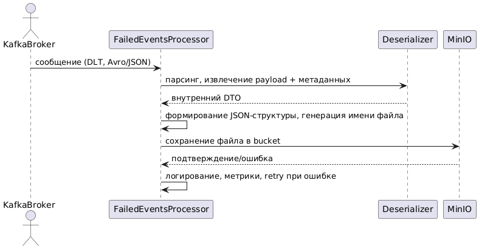

Реализация сервиса failed-events-processor

Цель модуля
Разработать микросервис failed-events-processor, который:

Подписывается на Kafka Dead Letter Topic (DLT) и получает сообщения о событиях, которые не удалось обработать другими сервисами.
Формирует на основе этих сообщений структурированные JSON-файлы.
Сохраняет полученные JSON-файлы в объектное хранилище MinIO.
Экспортирует метрики и healthcheck для мониторинга.
Архитектурные требования
Компоненты
Микросервис на Java 24 с использованием Spring Boot 3.5.
Подключение к Apache Kafka (DLT topic, например, dlt-topic).
Сериализация полученных сообщений в структурированные JSON-файлы.
Сохранение файлов в MinIO (S3-compatible, REST API).
Экспорт стандартных метрик, liveness/readiness через Spring Actuator.
Локальное окружение и тестирование — через Testcontainers (Kafka, MinIO).
Входной формат данных
Сообщения поступают из Kafka DLT (Dead Letter Topic).
Формат событий соответствует исходным событиям из событийных топиков (Avro), либо уже сериализован в JSON (обязательно предусмотреть оба варианта).
Входное сообщение обязательно содержит:
1.3. Структура хранения в MinIO
Каждый файл — отдельный объект в MinIO (bucket failed-events).
Формат файла: JSON (пример структуры ниже).
Именование файлов: __.json
Bucket должен создаваться автоматически при старте сервиса (если не существует).
Пример структуры JSON:

1
2
3
4
5
6
7
8
9
10
11
12
13
14
15
{
"failedEvent": {
"eventId": "string",
"deviceId": "string",
"type": "string",
"timestamp": 1718893844555,
"payload": "string"
},
"errorMeta": {
"errorSource": "device-collector-service",
"reason": "DB write timeout",
"stackTrace": "org.postgresql.util.PSQLException: Timeout..."
},
"receivedAt": 1718893845777
}
{
"failedEvent": {
"eventId": "string",
"deviceId": "string",
"type": "string",
"timestamp": 1718893844555,
"payload": "string"
},
"errorMeta": {
"errorSource": "device-collector-service",
"reason": "DB write timeout",
"stackTrace": "org.postgresql.util.PSQLException: Timeout..."
},
"receivedAt": 1718893845777
}
Функциональные требования
Обработка сообщений
Подписка на DLT Kafka-топик.
Обработка сообщений по одному (или батчами) с разбором формата (Avro).
Формирование структурированного JSON-объекта с деталями события и ошибкой.
Генерация уникального имени для файла на основе типа события, времени и UUID.
Сохранение сформированного файла в MinIO в бакет failed-events.
Логирование всех успешных и ошибочных операций.
Мониторинг
Экспонирование стандартных метрик и healthcheck-эндпоинтов через Spring Actuator.
Метрики по количеству обработанных сообщений и ошибок.
Нефункциональные требования
Минимальная задержка между получением сообщения из Kafka и сохранением файла в MinIO (<200ms при стандартной нагрузке).
Высокая отказоустойчивость (повторная попытка сохранения при временных ошибках MinIO, с логированием и лимитом ретраев).
Микросервис полностью автономен — запускается локально через docker-compose (Kafka, MinIO).
Тестирование
Unit-тесты
Парсинг и обработка сообщений (Avro → внутренний DTO).
Формирование структуры JSON-файла.
Генерация корректного имени файла.
Integration-тесты
Получение сообщения из Kafka и корректное сохранение файла в MinIO.
Проверка создания бакета при отсутствии.
Тестирование обработки ошибок (недоступность MinIO/Kafka, невалидный payload).
Использование Testcontainers (Kafka + MinIO).
Критерии приемки
Использование Spring Kafka Consumer для подписки на DLT.
Корректная обработка и десериализация входящих сообщений (Avro).
Структурированное формирование JSON-файлов по шаблону.
Уникальное и читаемое именование файлов.
Гарантия сохранения файлов в MinIO, с автоматическим созданием bucket'а.
Метрики, healthcheck и корректное логирование ошибок.
90%+ покрытие автотестами (unit + integration).
README.md с инструкцией по запуску, архитектурным описанием, C4-диаграммами (context + container), sequence-диаграммой (PlantUML).
Пример docker-compose.yaml и smoke-тест на обработку тестового события.
Диаграммы и документация
C4-модель (context + container + component) — в формате PlantUML.
Sequence-диаграмма: получение сообщения из Kafka → формирование JSON → сохранение в MinIO → логирование результата.
README с описанием архитектурных решений, примером формата входных/выходных данных, командой запуска и инструкцией по тестированию.
Дополнительные замечания

@startuml
actor KafkaBroker
participant "FailedEventsProcessor" as FEP
participant "Deserializer" as DES
participant "MinIO" as MINIO

KafkaBroker -> FEP : сообщение (DLT, Avro/JSON)
FEP -> DES : парсинг, извлечение payload + метаданных
DES --> FEP : внутренний DTO
FEP -> FEP : формирование JSON-структуры, генерация имени файла
FEP -> MINIO : сохранение файла в bucket
MINIO --> FEP : подтверждение/ошибка
FEP -> FEP : логирование, метрики, retry при ошибке
@enduml
@startuml
actor KafkaBroker
participant "FailedEventsProcessor" as FEP
participant "Deserializer" as DES
participant "MinIO" as MINIO

KafkaBroker -> FEP : сообщение (DLT, Avro/JSON)
FEP -> DES : парсинг, извлечение payload + метаданных
DES --> FEP : внутренний DTO
FEP -> FEP : формирование JSON-структуры, генерация имени файла
FEP -> MINIO : сохранение файла в bucket
MINIO --> FEP : подтверждение/ошибка
FEP -> FEP : логирование, метрики, retry при ошибке
@enduml

---

## 🗣️ **Мои комментарии:**

Добрый вечер!
MR: https://gitlab.proselyte.net/ourcode-iot-quebec/slf4u0/-/merge_requests/5

Сделано:

обновила контейнерную диаграмму,

добавила компонентную и диаграмму последовательности.