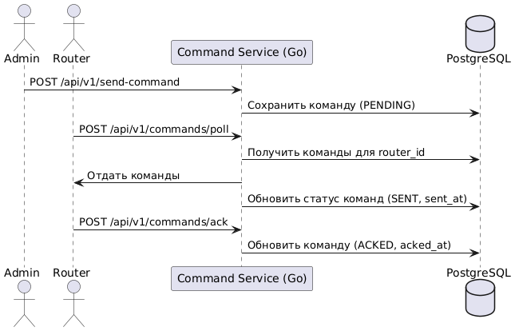

Реализация router-mananger-service для управления роутерами

Цель модуля
Разработать gRPC API на Go, который:

Позволяет отправлять команды одному или всем роутерам.
Сохраняет команды и статус их обработки в PostgreSQL.
Отдаёт роутерам команды по их router_id по запросу.
Принимает подтверждение выполнения команд от роутеров.
Архитектурные требования
Компоненты
Приложение на Go 1.20+.
Использование PostgreSQL (подключение через pgx или ORM gorm).Веб-фреймворк: Gin, Fiber или стандартный net/http (на выбор).
gRPC API v1 с namespace /api/v1.Тестирование с помощью стандартной библиотеки Go, mock-хранилище для unit-тестов.
Docker Compose для локального запуска (Postgres + сервис).
Конфигурирование через ENV-переменные или config-файл.
Структура базы данных
1
2
3
4
5
6
7
8
9
10
11
12
13
14
15
16
17
18
CREATE TABLE routers (
id UUID PRIMARY KEY,
serial_number TEXT UNIQUE NOT NULL,
last_seen_at TIMESTAMP,
created_at TIMESTAMP DEFAULT now()
);

CREATE TABLE commands (
id UUID PRIMARY KEY,
router_id UUID REFERENCES routers(id),
command_type TEXT NOT NULL, -- REBOOT, PING и т.д.
payload JSONB,
status TEXT NOT NULL DEFAULT 'PENDING', -- PENDING, SENT, ACKED, FAILED
sent_at TIMESTAMP,
acked_at TIMESTAMP,
created_at TIMESTAMP DEFAULT now()
);

CREATE TABLE routers (
id UUID PRIMARY KEY,
serial_number TEXT UNIQUE NOT NULL,
last_seen_at TIMESTAMP,
created_at TIMESTAMP DEFAULT now()
);

CREATE TABLE commands (
id UUID PRIMARY KEY,
router_id UUID REFERENCES routers(id),
command_type TEXT NOT NULL, -- REBOOT, PING и т.д.
payload JSONB,
status TEXT NOT NULL DEFAULT 'PENDING', -- PENDING, SENT, ACKED, FAILED
sent_at TIMESTAMP,
acked_at TIMESTAMP,
created_at TIMESTAMP DEFAULT now()
);

Функциональные требования
gRPC
gRPC /api/v1/send-command

Отправка команды одному или всем роутерам.Тело запроса:

1
2
3
4
5
{
"router_id": "uuid или null",
"command_type": "REBOOT",
"payload": { ... }
}
{
"router_id": "uuid или null",
"command_type": "REBOOT",
"payload": { ... }
}
Если router_id не указан, команда отправляется всем зарегистрированным роутерам.
Новая команда сохраняется в таблицу commands со статусом PENDING.
gRPC /api/v1/commands/poll

Роутер запрашивает свои команды.

Тело запроса:

1
2
3
{
"router_id": "uuid"
}
{
"router_id": "uuid"
}
Возвращает список команд со статусом PENDING или SENT для данного роутера.
При отдаче команд статус меняется на SENT, обновляется поле sent_at.
gRPC /api/v1/commands/ack

Роутер подтверждает выполнение команды.Тело запроса:

1
2
3
4
{
"router_id": "uuid",
"command_id": "uuid"
}
{
"router_id": "uuid",
"command_id": "uuid"
}
Обновляет статус команды на ACKED, проставляет время в acked_at.
Логика
При каждом запросе роутера обновлять его last_seen_at.
Для каждой команды отслеживать полный цикл: PENDING → SENT → ACKED/FAILED.
Поддержка массовых команд (одна команда для всех роутеров).
Все операции должны быть атомарны и логироваться.
Нефункциональные требования
Обработка ошибок БД и валидация данных.
Минимальная задержка (API должен отвечать менее чем за 200 мс при стандартной нагрузке).
Конфигурируемость: все параметры через ENV/config.
Докеризация и локальный запуск через docker-compose.
Тестирование
Unit-тесты
Проверка бизнес-логики формирования и обработки команд (mock DB).
Проверка сериализации/десериализации входных/выходных структур.
Integration-тесты
Запуск сервиса с тестовой Postgres (Testcontainers/docker-compose).
Проверка работы всех gRPC эндпоинтов (создание роутера, отправка/получение/подтверждение команды).
Проверка корректного обновления статусов.
Нагрузочное тестирование
Необходимо реализовать нагрузочное тестирование средствами JMeter (JMeter gRPC Request).
Необходимо предоставить отчет о тестировании, выявить узкие места системы и оптимизировать их.
Критерии приемки
Реализация gRPC API по всем заявленным эндпоинтам.
Корректная обработка команд, статусов и жизненного цикла команды.
Вся логика покрыта unit- и integration-тестами (покрытие 80%+).
README.md с инструкцией по запуску, миграции схемы, примерами запросов и архитектурным описанием.
docker-compose.yaml для локального запуска (Postgres + сервис).
Диаграммы и документация
C4-модель (component) + sequence для основных сценариев (отправка, получение, ack команды).
README с описанием архитектуры, примерами входных и выходных данных, командой запуска и инструкцией по тестированию.
Дополнительные замечания
Выбор библиотеки миграций (golang-migrate или аналог) на усмотрение.
Все чувствительные параметры (dsn, passwords) вынести в переменные окружения.
Код должен соответствовать Go code style (gofmt, golint).
Предоставить smoke-тест (curl/HTTPie) для проверки полного жизненного цикла команды.
Пример последовательности работы:

1
2
3
4
5
6
7
8
9
10
11
12
13
14
15
16
17
@startuml
actor Admin
actor Router
participant "Command Service (Go)" as CS
database "PostgreSQL" as PG

Admin -> CS : POST /api/v1/send-command
CS -> PG : Сохранить команду (PENDING)

Router -> CS : POST /api/v1/commands/poll
CS -> PG : Получить команды для router_id
CS -> Router : Отдать команды
CS -> PG : Обновить статус команд (SENT, sent_at)

Router -> CS : POST /api/v1/commands/ack
CS -> PG : Обновить команду (ACKED, acked_at)
@enduml
@startuml
actor Admin
actor Router
participant "Command Service (Go)" as CS
database "PostgreSQL" as PG

Admin -> CS : POST /api/v1/send-command
CS -> PG : Сохранить команду (PENDING)

Router -> CS : POST /api/v1/commands/poll
CS -> PG : Получить команды для router_id
CS -> Router : Отдать команды
CS -> PG : Обновить статус команд (SENT, sent_at)

Router -> CS : POST /api/v1/commands/ack
CS -> PG : Обновить команду (ACKED, acked_at)
@enduml

---

## 🗣️ **Мои комментарии:**

Добрый день!
MR: https://gitlab.proselyte.net/ourcode-iot-quebec/slf4u0/-/merge_requests/6

Сделано:

обновила контейнерную диаграмму,

добавила компонентную и диаграмму последовательности.