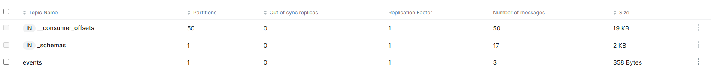
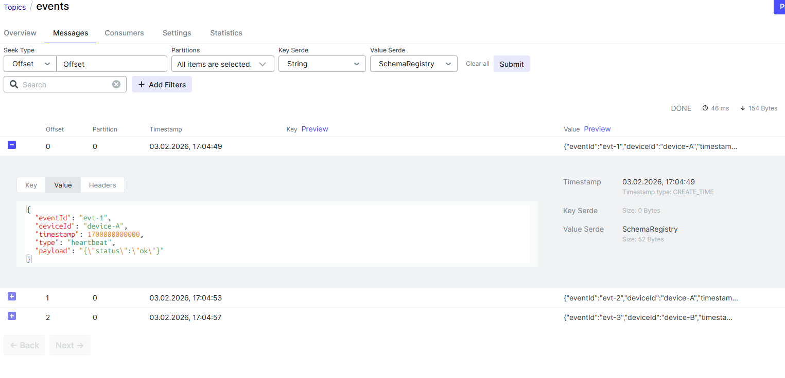
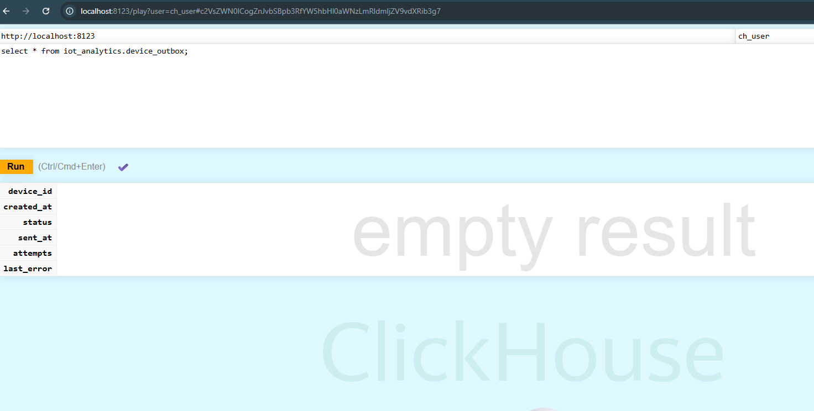
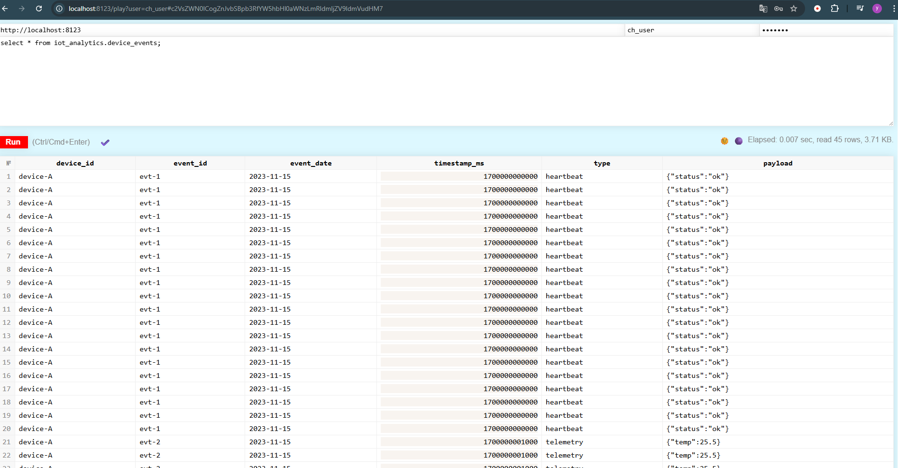
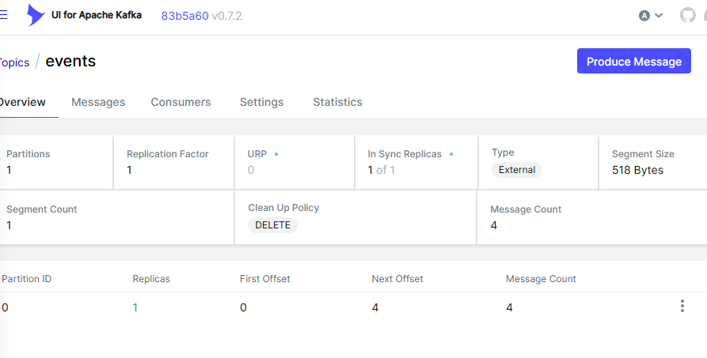
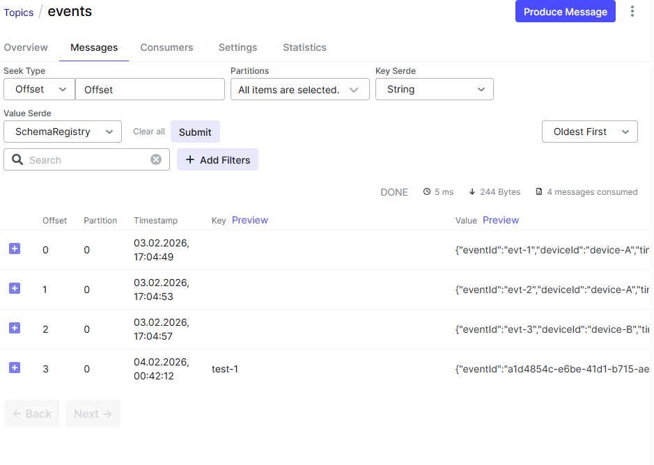

# 📝 Отчёт по тестированию events-collector-service

## 🎯 Цель
Проверить, что:
1. Сообщения в формате Avro корректно отправляются в Kafka.
2. Сервис events-collector-service их принимает, обрабатывает и сохраняет в ClickHouse.
3. Уникальные deviceId публикуются в топик devices.

## 🔧 Шаг 1: Запуск инфраструктуры
Выполнила в корне проекта:
```bash
make
``` 

>✅ Все образы запустилась без ошибок.
Доступны:
>* Kafka UI: http://localhost:8070
>* Schema Registry: http://localhost:8081
>* ClickHouse: http://localhost:8123/play

## 📤 Шаг 2: Отправка тестовых Avro-сообщений
Открыла новое окно терминала и выполнила:
```bash
cd infrastructure
docker run --rm -it --network infrastructure_default -v ${PWD}:/schemas confluentinc/cp-schema-registry:7.5.0 kafka-avro-console-producer --bootstrap-server kafka:29092 --topic events --property schema.registry.url=http://schema-registry:8081 --property value.schema.file=/schemas/DeviceEvent.avsc
```

Ввела три сообщения по очереди:
```json
{"eventId":"evt-1","deviceId":"device-A","timestamp":1700000000000,"type":"heartbeat","payload":"{\"status\":\"ok\"}"}
{"eventId":"evt-2","deviceId":"device-A","timestamp":1700000001000,"type":"telemetry","payload":"{\"temp\":25.5}"}
{"eventId":"evt-3","deviceId":"device-B","timestamp":1700000002000,"type":"alert","payload":"{\"level\":\"warning\"}"}
```

>* ✅ В Kafka UI (http://localhost:8070 → Topics → events) увидела 3 сообщения в формате AVRO.
>* ✅ Message Count = 3.




## 🖥️ Шаг 3: Проверка данных в ClickHouse
Перешла в http://localhost:8123/play , вверху ввела username/password и выполнила по отдельности:
```sql
SELECT * FROM iot_analytics.device_events;
SELECT * FROM iot_analytics.device_outbox;
```



>❌ Запрос из таблицы device_outbox вернул empty result.

## 📊 Шаг 4: Проверка метрик сервиса
Открыла в браузере:
* http://localhost:8091/actuator/metrics/events.processed.total
* http://localhost:8091/actuator/metrics/events.duplicates.total

>* ❌ Обе метрики показали 0.
>* ⚠️ Вывод: events-collector-service не обрабатывает сообщения.

## ▶️ Шаг 5: Запуск events-collector-service
Запустила сервис локально (из папки services/events-collector-service):

```powershel
./gradlew bootRun --args='--spring.profiles.active=local'
```

>* ✅ Сервис стартовал, health-check /actuator/health — UP.
>* ✅ Подключился к Redis, Kafka, ClickHouse.

Но в логах появились ошибки:
```
Caused by: org.springframework.messaging.converter.MessageConversionException:
Cannot convert from [org.apache.avro.generic.GenericData$Record] to [com.slf4u0.avro.DeviceEvent]
```
> ❌ Это означает: Kafka-слушатель ожидает DeviceEvent, но получает GenericRecord.

## 🔍 Шаг 6: Анализ конфигурации
Проверила файл application-local.yml:
```yaml
spring:
  kafka:
    consumer:
      properties:
        specific.avro.reader: false   # ← вот проблема!
```
>* ❗ При specific.avro.reader: false Confluent возвращает GenericRecord.
>* ❗ Но слушатель принимает DeviceEvent — сгенерированный Java-класс.

Также проверила, что класс DeviceEvent сгенерирован:
```bash
./gradlew generateAvroJava
```
> ✅ Файл build/generated-main-avro-java/com/slf4u0/avro/DeviceEvent.java существует.

## 🛠️ Шаг 7: Попытки исправления

### Попытка 1: Изменить specific.avro.reader: true
Изменила в application-local.yml:
```yaml
specific.avro.reader: true
```
Перезапустила сервис → **та же ошибка**.
>❗ Причина: используется кастомная конфигурация KafkaConsumerConfig, которая жёстко задаёт GenericRecord:

```java
@Bean
public ConsumerFactory<String, GenericRecord> consumerFactory() { ... }
```

→ Spring игнорирует application.yml и использует эту фабрику.

### Попытка 2: Переписать KafkaConsumerConfig под DeviceEvent
Изменила:
```java
@Bean
public ConsumerFactory<String, DeviceEvent> consumerFactory() {
    // ...
    props.put("value.deserializer", KafkaAvroDeserializer.class);
    props.put("specific.avro.reader", true);
}
```

→ Сервис запустился, но ошибка осталась.
>❗ Вероятно, из-за того, что ErrorHandlingDeserializer не передаёт свойства в делегат.

## 🧪 Шаг 8: Итоговое состояние
| Компонент | Состояние |
|--------|-------------|
| Kafka (events) | ✅ 3 сообщения |
| Kafka UI (events) | ✅ Читаемые Avro-сообщения |
| Kafka UI (devices) | ❌ Пусто (никогда не публиковалось) |
| ClickHouse (device_outbox) | ❌ Пусто |
| Метрики (events.processed.total) | ❌ 0 |
| Логи events-collector-service | ❌ Cannot convert GenericRecord → DeviceEvent |


# 📝 Отчёт по тестированию emulator-service

## 🎯 Цель
Создать сервис для отправки тестовых событий в Kafka:
- Поддержка Avro-формата (в соответствии с утверждённой схемой).
- Возможность отправки через REST API (/send-script-data, /send-controller-data и др.).
- Совместимость с events-collector-service.

## Шаги выполнения

1. Выполнить сборку Авро
```
cd services/emulator-service
./gradlew generateAvroJava
```

2. Проверить, что появилась:
```
build/generated-main-avro-java/com/slf4u0/avro/DeviceEvent.java
```

3. в root директории выполнить команду
```
make
```

4. в git bash выполнить команду 
```
$ curl -X POST "http://localhost:8092/api/emulator/send-script-data" \
  --data-urlencode "deviceId=test-1" \
  --data-urlencode "type=heartbeat" \
  --data-urlencode 'payload={"status":"ok"}'
  % Total    % Received % Xferd  Average Speed   Time    Time     Time  Current
                                 Dload  Upload   Total   Spent    Left  Speed
100   101  100    33  100    68     36     74 --:--:-- --:--:-- --:--:--   111Sent script data to Kafka: test-1

```

В kafka ui отображается message count = 4, но просмотреть его не получается.



# TestContainer

## 1. Окружение
| Компонент | Версия / Конфигурация                                                                                                 |
|--------|-----------------------------------------------------------------------------------------------------------------------|
| ОС | Windows 11                                                                                                            |
| Docker Desktop | Версия 4.59.0. В настройках:<br/> * ☑️ «Use the WSL 2 based engine» (серая галочка, недоступна для изменения)<br/> * ☐ «Expose daemon on tcp://localhost:2375 without TLS» (галочка снята при тестировании) |
| Java| JDK 24.0.2                                                                                                            |
| Gradle | 8.14.3                                                                                                                |
| Testcontainers | 1.20.4                                                                                                                |
| Проект | Gradle-based Spring Boot приложение (модуль events-collector-service)                                                 |
| Терминал | PowerShell (Windows)                                                                                                  |

## 2. Суть проблемы
**docker CLI работает корректно, но Testcontainers не может подключиться к Docker Engine** через npipe (Windows Named Pipe), несмотря на то, что:
* Docker Desktop запущен и стабилен
* docker run hello-world выполняется успешно
* Все три стратегии обнаружения Docker (TestcontainersHostPropertyClientProviderStrategy, EnvironmentAndSystemPropertyClientProviderStrategy, NpipeSocketClientProviderStrategy) завершаются с одинаковой ошибкой

## 3. Шаги для воспроизведения

### Шаг 1: Проверка работы Docker CLI
```powershell
PS C:\> docker run --rm hello-world
```

✅ Результат: образ скачивается и запускается успешно. Вывод:
```
Hello from Docker!
This message shows that your installation appears to be working correctly.
```

### Шаг 2: Запуск теста с Testcontainers
```java
package com.slf4u0.eventscollectorservice;

import org.junit.jupiter.api.Test;
import org.testcontainers.containers.GenericContainer;
import org.testcontainers.junit.jupiter.Container;
import org.testcontainers.junit.jupiter.Testcontainers;

import static org.assertj.core.api.Assertions.assertThat;

@Testcontainers
class DockerConnectionTest {
    @Container
    private static final GenericContainer<?> redis = new GenericContainer<>("redis:7.2-alpine")
            .withExposedPorts(6379);

    @Test
    void shouldStartRedisContainer() {
        assertThat(redis.isRunning()).isTrue();
    }
}
```

```powershell
PS C:\path\to\project> ./gradlew test --tests "*DockerConnectionTest*"
```
❌ Результат: тест падает с ошибкой:

```
java.lang.IllegalStateException: Could not find a valid Docker environment. Please see logs and check configuration
	at org.testcontainers.dockerclient.DockerClientProviderStrategy.lambda$getFirstValidStrategy$7(DockerClientProviderStrategy.java:274)
	...
```

## 4. Ключевые фрагменты лога
```
17:00:29.155 [Test worker] INFO org.testcontainers.DockerClientFactory -- Testcontainers version: 1.21.3

17:00:29.967 [Test worker] ERROR org.testcontainers.dockerclient.DockerClientProviderStrategy -- 
Could not find a valid Docker environment. Please check configuration. Attempted configurations were:

	TestcontainersHostPropertyClientProviderStrategy: failed with exception BadRequestException (Status 400: 
	{"ID":"","Containers":0,"ContainersRunning":0,"ContainersPaused":0,"ContainersStopped":0,"Images":0,
	"Driver":"","DriverStatus":null,"Plugins":{"Volume":null,"Network":null,"Authorization":null,"Log":null},
	"MemoryLimit":false,"SwapLimit":false,"CpuCfsPeriod":false,"CpuCfsQuota":false,"CPUShares":false,
	"CPUSet":false,"PidsLimit":false,"IPv4Forwarding":false,"Debug":false,"NFd":0,"OomKillDisable":false,
	"NGoroutines":0,"SystemTime":"","LoggingDriver":"","CgroupDriver":"","NEventsListener":0,
	"KernelVersion":"","OperatingSystem":"","OSVersion":"","OSType":"","Architecture":"",
	"IndexServerAddress":"","RegistryConfig":null,"NCPU":0,"MemTotal":0,"GenericResources":null,
	"DockerRootDir":"","HttpProxy":"","HttpsProxy":"","NoProxy":"","Name":"",
	"Labels":["com.docker.desktop.address=npipe://\\\\.\\pipe\\docker_cli"],
	"ExperimentalBuild":false,"ServerVersion":"","Runtimes":null,"DefaultRuntime":"",
	"Swarm":{"NodeID":"","NodeAddr":"","LocalNodeState":"","ControlAvailable":false,"Error":"",
	"RemoteManagers":null},"LiveRestoreEnabled":false,"Isolation":"","InitBinary":"",
	"ContainerdCommit":{"ID":""},"RuncCommit":{"ID":""},"InitCommit":{"ID":""},
	"SecurityOptions":null,"CDISpecDirs":null,"Warnings":null})

	EnvironmentAndSystemPropertyClientProviderStrategy: failed with same exception...

	NpipeSocketClientProviderStrategy: failed with same exception...
```

### Анализ ответа от Docker API:
* Статус: HTTP 400 BadRequest
* Тело ответа: неполный/пустой JSON — все ключевые поля (ID, Containers, Images, NCPU, MemTotal и др.) имеют пустые значения
* Единственное заполненное поле:
```json
"Labels": ["com.docker.desktop.address=npipe://\\\\.\\pipe\\docker_cli"]
```
* Это указывает на то, что соединение через npipe устанавливается, но ответ от Docker Daemon не соответствует ожидаемому формату, который парсит docker-java

## 5. Что уже пробовали
| Действие | Результат                                                                                               |
|--------|-----------------------------------------------------------------------------------------------------------------------|
| Обновление Testcontainers с 1.20.4 → 1.21.3 | ❌ Ошибка сохраняется                                                                                                        |
| Включение галочки «Expose daemon on tcp://localhost:2375» + $env:DOCKER_HOST="tcp://localhost:2375" | ❌ Не помогло   |
| Создание ~/.testcontainers.properties с указанием стратегии| ❌ Не помогло                                                                                                           |
| Проверка docker info и docker run hello-world | ✅ Работает без ошибок                                                                                                         |
| Перезапуск Docker Desktop и IDE | ❌ Не помогло                                                                                                               |
